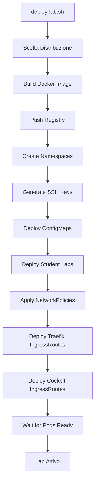

# Linux Lab su Kubernetes

Sistema completo per laboratori didattici Linux basato su container Kubernetes con accesso web tramite Code-Server e Cockpit, routing Traefik.

## 🎯 Caratteristiche

- ✅ **Container con systemd** - Esperienza VM-like realistica
- ✅ **SSH automatico** - Chiavi pre-configurate tra macchine
- ✅ **Doppio accesso web** - Code-Server (IDE) + Cockpit (System Management)
- ✅ **Cockpit integrato** - GUI per amministrazione sistema Linux via browser
- ✅ **Traefik Ingress** - Routing dinamico con TLS automatico
- ✅ **Isolamento completo** - Namespace e NetworkPolicy per studente
- ✅ **Sicurezza hardened** - SecurityContext, capabilities limitate
- ✅ **Multi-distro** - Ubuntu 24.04, Debian Trixie o Rocky Linux 10
- ✅ **Sudo configurabile** - Modalità strict/limited/full
- ✅ **Scalabile** - Da 1 a N studenti
- ✅ **Monitoring** - Prometheus + Grafana dashboard inclusi

---

## 📁 Struttura Progetto

```
linux-lab-k8s/
├── README.md
├── .gitignore
│
├── docker/
│   ├── Dockerfile-ubuntu          # Ubuntu 24.04 LTS
│   ├── Dockerfile-debian          # Debian Trixie
│   ├── Dockerfile-rocky           # Rocky Linux 10
│   ├── entrypoint.sh              # Script avvio container
│   ├── setup-ssh-keys.sh          # Configurazione SSH
│   └── sudoers-config.sh          # Configurazione sudo
│
├── kubernetes/
│   ├── 01-namespaces.yaml         # Namespace studenti
│   ├── 02-ssh-config.yaml         # ConfigMap SSH
│   ├── 03-ssh-keygen-job.yaml     # Job generazione chiavi
│   ├── 04-student-lab-secure.yaml # Deployment completo
│   ├── 05-network-policies.yaml   # Isolamento network
│   ├── 06-resource-limits.yaml    # Quote risorse
│   ├── 07-traefik-middleware.yaml # Middleware Traefik
│   ├── 08-traefik-tls.yaml        # TLS configuration
│   ├── 09-prometheus-monitoring.yaml  # Monitoring pod
│   ├── 10-traefik-monitoring.yaml     # Monitoring Traefik
│   └── 11-grafana-dashboard.yaml      # Dashboard Grafana
│
├── scripts/
│   ├── deploy-lab.sh              # Deploy automatico
│   ├── generate-ssh-keys-local.sh # Generazione chiavi locale
│   ├── test-ssh-setup.sh          # Test SSH
│   ├── management-commands.sh     # Comandi gestione
│   ├── cleanup-lab.sh             # Pulizia completa
│   └── generate-web-credentials.sh # Password web (opzionale)
│
├── docs/
│   ├── ESERCITAZIONI.md           # Guida esercitazioni
│   ├── TRAEFIK-SETUP.md           # Setup Traefik
│   └── WEB-SECURITY.md            # Sicurezza accesso web
│
└── grafana/
    └── student-lab-dashboard.json # Dashboard JSON
```

---

## 🚀 Quick Start

### 1. Prerequisiti

**Tool necessari:**
```bash
# Kubernetes cluster 1.24+
kubectl version

# Docker
docker --version

# Traefik Ingress Controller
kubectl get crd ingressroutes.traefik.containo.us

# Cert-Manager (opzionale per TLS)
kubectl get crd certificates.cert-manager.io

# Prometheus Operator (opzionale per monitoring)
kubectl get crd prometheusrules.monitoring.coreos.com
```

**Installazione dipendenze mancanti:**

```bash
# Traefik
helm repo add traefik https://traefik.github.io/charts
helm install traefik traefik/traefik -n traefik --create-namespace

# Cert-Manager
kubectl apply -f https://github.com/cert-manager/cert-manager/releases/download/v1.13.0/cert-manager.yaml

# Prometheus Operator (opzionale)
helm repo add prometheus-community https://prometheus-community.github.io/helm-charts
helm install kube-prometheus prometheus-community/kube-prometheus-stack -n monitoring --create-namespace
```

---

### 2. Configurazione

Modifica le variabili in `scripts/deploy-lab.sh`:

```bash
# Registry Docker
export REGISTRY="your-registry.io"
export IMAGE_NAME="linux-lab"
export IMAGE_TAG="latest"

# Configurazione Lab
export NUM_STUDENTS="6"
export BASE_DOMAIN="lab.example.com"
export SUDO_MODE="limited"  # strict | limited | full
```

**Modalità Sudo:**
- **strict**: Password richiesta per tutti i comandi sudo
- **limited**: Password solo per comandi sensibili (default)
- **full**: Nessuna password (solo per lab privati)

---

### 3. Deploy

```bash
cd linux-lab-k8s
chmod +x scripts/*.sh

# Deploy completo con scelta distribuzione interattiva
./scripts/deploy-lab.sh

# Lo script chiederà:
# 1) Ubuntu 24.04 LTS
# 2) Debian Trixie
# 3) Rocky Linux 10
```

**Output atteso:**
```
==========================================
  LINUX LAB K8S DEPLOYMENT
==========================================

Scegli la distribuzione Linux per i container:

  1) Ubuntu 24.04 LTS (Debian-based)
  2) Debian Trixie (testing)
  3) Rocky Linux 10 (RHEL-compatible)

Scelta [1-3]: 1

✓ Building and pushing Docker image...
✓ Creating namespaces...
✓ Generating SSH keys...
✓ Deploying student labs...
✓ Deploying Traefik ingress...
✓ Deploying Cockpit routes...
✓ All pods ready!

Student Access URLs:
  Student 1:
    - Code-Server: https://student1.lab.example.com
    - Cockpit GUI: https://student1.lab.example.com/cockpit
  ...
```

---

### 4. Accesso Studenti

Gli studenti accedono via browser a due interfacce:

**Code-Server (IDE per sviluppo)**
- **URL**: `https://studentN.lab.example.com`
- **Password**: Generata dinamicamente (vedi file credentials)
- **Uso**: Coding, scripting, terminal integrato

**Cockpit (System Administration)**
- **URL**: `https://studentN.lab.example.com/cockpit`
- **Username**: `student`
- **Password**: Password Linux (vedi file credentials)
- **Uso**: Gestione servizi, utenti, monitoring, configurazione sistema

**Cosa trovano:**
- Code-Server (VS Code nel browser)
- Cockpit (GUI amministrazione sistema su /cockpit)
- Terminale integrato
- 3 macchine: `client`, `server1`, `server2`
- SSH configurato automaticamente

**Comandi rapidi:**
```bash
# Dal terminale Code-Server
ssh server1       # Connessione a server1
ssh server2       # Connessione a server2
htop             # Monitor risorse
systemctl status # Verifica servizi (o usa Cockpit GUI)
sudo su          # Diventa root (o gestisci utenti via Cockpit)
```

---

## 🔧 Comandi Gestione

### Monitoraggio

```bash
# Visualizza tutti i pod studenti
./scripts/management-commands.sh view_all_pods

# Status dettagliato studente 1
./scripts/management-commands.sh view_student_status 1

# Risorse utilizzate
./scripts/management-commands.sh view_resources

# Health check completo
./scripts/management-commands.sh health_check

# Statistiche lab
./scripts/management-commands.sh stats
```

### Debugging

```bash
# Visualizza logs
./scripts/management-commands.sh get_logs 1 client

# Shell in container Linux
./scripts/management-commands.sh exec_shell 1 server1

# Shell in Code-Server container
./scripts/management-commands.sh exec_code_server 1

# Test connessione SSH
./scripts/test-ssh-setup.sh 1

# Debug completo pod
./scripts/management-commands.sh debug_pod 1 client
```

### Operazioni

```bash
# Reset singolo studente
./scripts/management-commands.sh reset_student 1

# Restart tutti i lab
./scripts/management-commands.sh reset_all_students

# Esegui comando su tutti i client
./scripts/management-commands.sh run_command_all_students 'uptime'

# Backup configurazione
./scripts/management-commands.sh backup_lab

# Pulizia completa
./scripts/cleanup-lab.sh
```

---

## 🏗 Architettura

### Componenti per Studente

```
┌─────────────────────────────────────────┐
│  Namespace: studentN                    │
│                                         │
│  ┌───────────────────────────────────┐  │
│  │ Client Pod                         │  │
│  │  ┌──────────────┐ ┌──────────────┐ │  │
│  │  │ Code-Server  │ │   Linux     │ │  │
│  │  │  (VS Code)   │ │ (systemd)  │ │  │
│  │  │   :8080      │ │ SSH  :22   │ │  │
│  │  │              │ │ Cockpit:90 │ │  │
│  │  └──────────────┘ └──────────────┘ │  │
│  └───────────────────────────────────┘  │
│                                         │
│  ┌───────────────┐  ┌───────────────┐ │
│  │ Server1 Pod   │  │ Server2 Pod   │ │
│  │    Linux      │  │    Linux      │ │
│  │    :22        │  │    :22        │ │
│  └───────────────┘  └───────────────┘ │
│                                         │
│  NetworkPolicy: Isolamento              │
│  ResourceQuota: 2 CPU / 5Gi RAM         │
└─────────────────────────────────────────┘
         │
         ▼
┌─────────────────────────────────────────┐
│  Traefik Ingress Controller             │
│  • HTTPS (TLS wildcard)                 │
│  • Rate limiting                         │
│  • Security headers                      │
│  • WebSocket support                     │
└─────────────────────────────────────────┘
         │
         ▼
    Internet (HTTPS)
```

### Accesso Utente

```
Browser → https://studentN.lab.example.com
                     │
                     ├──> /           → Code-Server (:8080)
                     │
                     └──> /cockpit    → Cockpit GUI (:9090)
```

### Flusso di Deploy



---

## 🔐 Sicurezza

### Implementazioni di Sicurezza

#### 1. **Container Isolation**
- Namespace separati per studente
- NetworkPolicy: deny-all + whitelist
- ResourceQuota per limitare risorse
- PodSecurityContext con capabilities minime

#### 2. **Network Security**
- Traefik middleware: rate-limit, security headers
- TLS automatico con cert-manager
- Egress limitato (solo DNS + internet esterni)
- Blocco accesso Kubernetes API e metadata service

#### 3. **Capabilities**
Container Linux usa **SOLO**:
```yaml
capabilities:
  add:
  - CHOWN
  - DAC_OVERRIDE
  - SETGID
  - SETUID
  - SYS_CHROOT
  - AUDIT_WRITE
  - SYS_NICE
  - SYS_RESOURCE
```

**NO SYS_ADMIN** - Evita container escape

#### 4. **Monitoring**
- Prometheus alerts per anomalie
- Log centralizzati
- Grafana dashboard per overview

---

## 📊 Resource Requirements

### Per Studente (3 pod)

| Componente | Request | Limit |
|------------|---------|-------|
| Code-Server | 250m CPU / 512Mi RAM | 1000m CPU / 1Gi RAM |
| Linux Client | 150m CPU / 256Mi RAM | 500m CPU / 512Mi RAM |
| Server1 | 100m CPU / 256Mi RAM | 500m CPU / 512Mi RAM |
| Server2 | 100m CPU / 256Mi RAM | 500m CPU / 512Mi RAM |
| **TOTALE** | **600m CPU / 1280Mi RAM** | **2500m CPU / 2560Mi RAM** |

### Cluster Sizing

| Studenti | CPU Minimo | RAM Minimo | Storage |
|----------|-----------|-----------|---------|
| 6 | 4 cores | 8GB | 60GB |
| 12 | 8 cores | 16GB | 120GB |
| 24 | 16 cores | 32GB | 240GB |

**Formula**: 
- CPU: `0.6 * N + 2` cores
- RAM: `1.3 * N + 2` GB
- Storage: `10 * N` GB

---

## 🎓 Credits

Sviluppato per laboratori didattici Linux avanzati.  
Tested con Kubernetes 1.28+, Traefik 2.10+, Code-Server 4.20+, Cockpit 9.x

**Maintainers**: Team Lab Infrastructure  
**Support**: lab-support@example.com
Esercitazioni

Consulta `docs/ESERCITAZIONI.md` per guide dettagliate:

1. **Comandi Base Linux** - Filesystem, permessi, ricerca
2. **Connessioni SSH** - Key-based auth, SCP, rsync
3. **Gestione Processi** - ps, top, jobs, systemctl
4. **Networking** - ip, netstat, nc, tunneling
5. **Script e Automazione** - Bash scripting, cron
6. **Amministrazione con Cockpit** - GUI per gestione sistema

---

## 🔧 Troubleshooting

### Pod non parte

```bash
# Verifica eventi
kubectl describe pod -n student1 -l app=client

# Verifica logs
kubectl logs -n student1 -l app=client -c linux --tail=50

# Verifica immagine
docker pull your-registry.io/linux-lab:latest
```

### SSH non funziona

```bash
# Test setup completo
./scripts/test-ssh-setup.sh 1

# Verifica chiavi
kubectl get secret ssh-keys -n student1
kubectl get secret ssh-keys -n student1 -o yaml

# Debug manuale
./scripts/management-commands.sh exec_shell 1 client
ls -la ~/.ssh/
cat ~/.ssh/id_rsa.pub
ssh -vvv server1
```

### Code-Server inaccessibile

```bash
# Verifica Traefik
kubectl get ingressroute -n student1
kubectl describe ingressroute student1-https -n student1

# Verifica service
kubectl get svc client -n student1

# Test interno
kubectl run test --rm -it --image=busybox -n student1 -- \
  wget -O- http://client:8080/healthz
```

### Cockpit non accessibile

```bash
# Verifica servizio Cockpit nel container
kubectl exec -n student1 -c linux $(kubectl get pod -n student1 -l app=client -o name | head -1) -- systemctl status cockpit.socket

# Verifica porta 9090 esposta
kubectl get svc client -n student1 -o yaml | grep 9090

# Verifica IngressRoute Cockpit
kubectl get ingressroute cockpit-route -n student1

# Test interno
kubectl run test --rm -it --image=busybox -n student1 -- \
  wget -O- --no-check-certificate https://client:9090
```

### Resource quota exceeded

```bash
# Verifica quota
kubectl describe resourcequota -n student1

# Verifica utilizzo reale
kubectl top pods -n student1

# Aumenta limiti
vim kubernetes/06-resource-limits.yaml
# Modifica requests.cpu e limits.cpu
kubectl apply -f kubernetes/06-resource-limits.yaml -n student1
```

### TLS certificate error

```bash
# Verifica certificate
kubectl get certificate -n default
kubectl describe certificate lab-wildcard-cert

# Verifica secret
kubectl get secret lab-wildcard-tls -n default

# Force renew
kubectl delete certificate lab-wildcard-cert -n default
kubectl apply -f kubernetes/08-traefik-tls.yaml
```

---

## 📈 Monitoring

### Prometheus Queries

```promql
# CPU per studente
sum(rate(container_cpu_usage_seconds_total{namespace=~"student.*"}[5m])) by (namespace)

# Memory per studente
sum(container_memory_usage_bytes{namespace=~"student.*"}) by (namespace) / 1024 / 1024

# HTTP requests per studente
sum(rate(traefik_service_requests_total{service=~"student.*"}[5m])) by (service)

# Latency P99
histogram_quantile(0.99, sum(rate(traefik_service_request_duration_seconds_bucket{service=~"student.*"}[5m])) by (service, le))
```

### Grafana Dashboard

Dashboard inclusa in `kubernetes/11-grafana-dashboard.yaml`:

- Active students count
- Pod health status
- CPU/Memory usage per student
- HTTP requests & latency
- Network traffic
- Resource quota usage

**Import**: 
```bash
kubectl apply -f kubernetes/11-grafana-dashboard.yaml
# Dashboard auto-imported se Grafana operator attivo
```

---

## 🔄 Upgrade e Manutenzione

### Update Immagine

```bash
# Build nuova versione
docker build -f docker/Dockerfile-ubuntu -t your-registry.io/linux-lab:v2 docker/
docker push your-registry.io/linux-lab:v2

# Rolling update
for i in {1..6}; do
  kubectl set image deployment/client -n student${i} \
    linux=your-registry.io/linux-lab:v2
  kubectl set image deployment/server1 -n student${i} \
    linux=your-registry.io/linux-lab:v2
  kubectl set image deployment/server2 -n student${i} \
    linux=your-registry.io/linux-lab:v2
done

# Verifica rollout
kubectl rollout status deployment/client -n student1
```

### Backup

```bash
# Backup configurazione
./scripts/management-commands.sh backup_lab backup-$(date +%Y%m%d)

# Backup manuale completo
for i in {1..6}; do
  kubectl get all,configmaps,secrets,ingress -n student${i} -o yaml \
    > backup-student${i}-$(date +%Y%m%d).yaml
done
```

---

## 🌍 Configurazione DNS

Per accesso pubblico, configura DNS:

```
# Wildcard record
*.lab.example.com.  A  <TRAEFIK_EXTERNAL_IP>

# O record individuali
student1.lab.example.com.  A  <TRAEFIK_EXTERNAL_IP>
student2.lab.example.com.  A  <TRAEFIK_EXTERNAL_IP>
...
```

**Nota**: Sia Code-Server che Cockpit sono accessibili dallo stesso dominio:
- `https://student1.lab.example.com` → Code-Server
- `https://student1.lab.example.com/cockpit` → Cockpit

**Trova IP Traefik:**
```bash
kubectl get svc -n traefik traefik -o jsonpath='{.status.loadBalancer.ingress[0].ip}'
```

---

## 🤝 Contributi

Per miglioramenti o bug report:

1. Fork del repository
2. Crea branch: `git checkout -b feature/improvement`
3. Commit: `git commit -am 'Add improvement'`
4. Push: `git push origin feature/improvement`
5. Pull Request

---

## 📄 Licenza

MIT License - Vedi LICENSE file

---

## 🎯 Roadmap

- [ ] Supporto multi-arch (ARM64)
- [ ] Persistent workspace con PVC
- [ ] Web terminal alternativo (ttyd)
- [ ] Integration con LMS (Moodle, Canvas)
- [ ] Auto-grading sistema esercizi
- [ ] Desktop environment (noVNC)

---

## 📚 Documentazione Aggiuntiva

- [`docs/ESERCITAZIONI.md`](docs/ESERCITAZIONI.md) - Guide esercitazioni complete
- [`docs/TRAEFIK-SETUP.md`](docs/TRAEFIK-SETUP.md) - Setup avanzato Traefik
- [`docs/WEB-SECURITY.md`](docs/WEB-SECURITY.md) - Sicurezza accesso web

---

## 💡 Tips & Best Practices

### Performance

- **Usa SSD** per storage cluster
- **Pre-pull immagini** su tutti i nodi prima del lab
- **Node affinity** per studenti su nodi dedicati
- **Limit CPU** per evitare noisy neighbors

### Sicurezza

- **Rotazione password** Code-Server ogni sessione
- **Audit logs** abilitati su namespace studenti
- **Network policies** sempre attive
- **Pod Security Standards** enforced

### Operatività

- **Backup** prima di ogni sessione lab
- **Monitoring** attivo durante le lezioni
- **Cleanup** automatico dopo lab
- **Testing** deployment su namespace dedicato prima della prod

---

## ❓ FAQ

**Q: Posso usare NGINX invece di Traefik?**  
A: Il progetto è ottimizzato per Traefik. Per NGINX serve riscrivere gli Ingress.

**Q: Rocky Linux 10 non esiste ancora, funziona?**  
A: Usa `rockylinux:9` per versione stabile. Rocky 10 sarà disponibile in futuro.

**Q: Quanti studenti posso supportare?**  
A: Dipende dal cluster. Con nodi da 16GB RAM: ~10-12 studenti. Con 32GB: ~20-24.

**Q: I dati persistono dopo restart?**  
A: Sì, usa PVC per workspace persistente.

**Q: Posso disabilitare monitoring?**  
A: Sì, non applicare i file 09-10-11. Il lab funziona senza monitoring.

**Q: Come aggiungo altri studenti?**  
A: Modifica `NUM_STUDENTS` in deploy script e ri-esegui. I namespace esistenti non sono toccati.

**Q: Cockpit richiede credenziali separate?**  
A: Sì, usa username `student` e la password Linux generata dinamicamente (diversa da Code-Server).

---

## 🎓